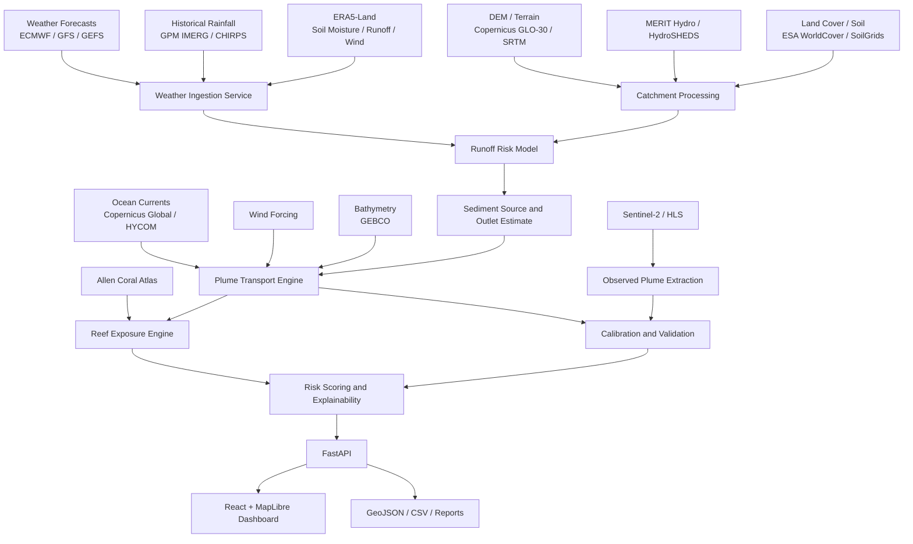
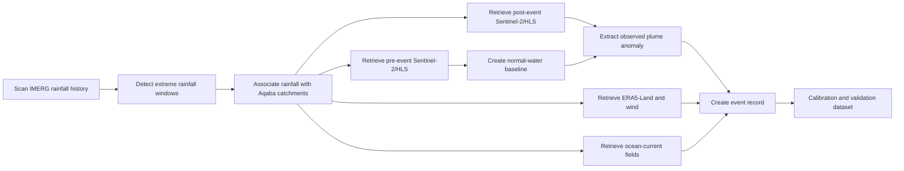

# ReefShield Aqaba
## AI-Powered Wadi-to-Reef Sediment Impact Forecasting and Early-Warning Platform

**Hackathon:** The Core Hacks — Blue Horizons  
**Track:** AI for Ocean Science  
**Location:** Aqaba, Jordan  
**Document type:** Technical concept, feasibility assessment, data plan, MVP specification, and implementation roadmap  
**Version:** 1.0  
**Prepared:** 31 July 2026

---

## Table of Contents

1. [Executive Summary](#1-executive-summary)
2. [The Problem](#2-the-problem)
3. [Why This Problem Matters in Aqaba](#3-why-this-problem-matters-in-aqaba)
4. [Proposed Solution](#4-proposed-solution)
5. [What Makes the Idea Different](#5-what-makes-the-idea-different)
6. [Target Users and Stakeholders](#6-target-users-and-stakeholders)
7. [User Journeys](#7-user-journeys)
8. [MVP Scope](#8-mvp-scope)
9. [System Architecture](#9-system-architecture)
10. [AI and Scientific Components](#10-ai-and-scientific-components)
11. [Data Availability and Access](#11-data-availability-and-access)
12. [Dataset Construction Strategy](#12-dataset-construction-strategy)
13. [Historical Backtesting and Validation](#13-historical-backtesting-and-validation)
14. [Risk Scoring Method](#14-risk-scoring-method)
15. [Dashboard and Demo Experience](#15-dashboard-and-demo-experience)
16. [Technical Stack](#16-technical-stack)
17. [API Design](#17-api-design)
18. [Database Design](#18-database-design)
19. [Suggested Repository Structure](#19-suggested-repository-structure)
20. [Two-Week Implementation Roadmap](#20-two-week-implementation-roadmap)
21. [Team Workstreams](#21-team-workstreams)
22. [Evaluation Metrics](#22-evaluation-metrics)
23. [Feasibility Assessment](#23-feasibility-assessment)
24. [Known Limitations](#24-known-limitations)
25. [Risks and Mitigations](#25-risks-and-mitigations)
26. [Path to Operational Deployment](#26-path-to-operational-deployment)
27. [Impact and Business Value](#27-impact-and-business-value)
28. [Pitch Positioning](#28-pitch-positioning)
29. [Recommended Final Problem Statement](#29-recommended-final-problem-statement)
30. [Recommended Final Solution Statement](#30-recommended-final-solution-statement)
31. [Data Acquisition Checklist](#31-data-acquisition-checklist)
32. [Reference Links](#32-reference-links)

---

# 1. Executive Summary

Aqaba is exposed to short, intense flash-flood events originating in surrounding hyper-arid catchments and wadis. These events can transport large quantities of sediment and land-based pollutants into the Gulf of Aqaba. Once the runoff reaches the sea, the resulting sediment plume can reduce water clarity, cover marine habitats, transport contaminants, and increase stress on coral reefs and seagrass.

Existing systems usually treat the problem as separate domains:

- Weather services forecast rainfall.
- Flood maps identify land areas vulnerable to runoff.
- Satellite platforms show coastal water conditions after an event.
- Marine surveys assess reef health periodically.
- Ocean models estimate regional currents.

There is a missing operational layer connecting these domains into one decision-support system.

**ReefShield Aqaba** is a software-only platform that predicts the complete pathway from rainfall to marine habitat exposure:

```text
Rainfall forecast
    → Wadi runoff probability
    → Sediment source and coastal outlet
    → Probabilistic marine plume movement
    → Coral and seagrass exposure
    → Risk alerts and recommended actions
```

The platform uses openly available Earth-observation, weather, terrain, hydrology, ocean, and reef-habitat datasets. It does not require the team to manufacture or deploy hardware for the hackathon MVP.

The MVP can be validated through historical backtesting. A previous flash-flood event is reconstructed using only data available before or during the event. The system's predicted plume and reef exposure are then compared with post-event satellite observations.

The strongest value proposition is not perfect environmental prediction. It is **earlier and more integrated situational awareness**:

> Aqaba's decision-makers can see which wadi is likely to discharge, where the plume may travel, which reef zones are at risk, how confident the model is, and where monitoring teams should focus.

---

# 2. The Problem

## 2.1 Core Problem

Aqaba currently lacks an integrated software system that predicts:

1. Which catchment or wadi is likely to generate hazardous runoff.
2. Where sediment-loaded water is expected to enter the Gulf.
3. How the sediment plume may spread after entering the sea.
4. Which coral reefs, seagrass areas, beaches, or dive sites are likely to be exposed.
5. How soon the exposure may occur.
6. What operational action should be prioritized.

## 2.2 Environmental Process

The physical process is cross-domain:

```text
Atmospheric process
Heavy or localized rainfall
        ↓
Terrestrial process
Runoff accumulation in steep dry catchments
        ↓
Transport process
Sediment, debris, metals, oils, and urban pollutants are mobilized
        ↓
Coastal discharge
Runoff exits through wadi or drainage outlet
        ↓
Marine process
Buoyant or dense sediment plume spreads, settles, or moves along the seabed
        ↓
Ecological exposure
Coral, seagrass, fish habitat, beaches, and tourism sites are affected
```

A system that models only rainfall, flooding, satellite imagery, or coral health captures only one part of the chain.

## 2.3 Operational Problem

Without integrated forecasting, environmental teams may have to react after:

- A visible plume has already formed.
- A satellite image becomes available.
- Divers report poor visibility or sediment deposition.
- Water-quality samples are collected manually.
- Reef stress is observed during later surveys.

This delay reduces the value of monitoring and response.

---

# 3. Why This Problem Matters in Aqaba

## 3.1 Aqaba's Geographic Context

Aqaba is located at the northern end of the Gulf of Aqaba, surrounded by steep, dry terrain and ephemeral drainage systems. Rainfall is usually limited, but localized storms can generate sudden, high-energy runoff because:

- The terrain is steep.
- Dry soils may have limited infiltration during intense rainfall.
- Wadis concentrate flow rapidly.
- Urban surfaces and drainage structures modify runoff routes.
- The coastal zone is narrow.
- Valuable coral habitats are located close to shore.

## 3.2 Scientific Evidence

Peer-reviewed research in the northern Gulf of Aqaba has documented that desert flash floods can produce sediment-rich flows entering the sea. Research has shown that:

- Flash floods can carry substantial terrestrial sediment into the Gulf.
- Flood-derived sediment input can exceed airborne dust input.
- Dense sediment-laden flows may move underwater and transport material toward deeper areas.
- Repeated sediment discharge can affect the distribution and condition of shallow coral habitats.

A 2025 analysis of an October 2016 event estimated that approximately **24,000 tonnes of suspended sediment** entered the northern Gulf during the main measured flood body. The same paper compared it with an estimated **21,000 tonnes** during a February 2013 event.

These numbers demonstrate that the problem is not hypothetical. The Gulf has experienced measurable, high-magnitude sediment events.

## 3.3 Local Environmental Sensitivity

Aqaba's reefs are ecologically and economically important. They support:

- Marine biodiversity.
- Diving and tourism.
- Education and scientific research.
- Coastal ecosystem services.
- Jordan's national marine identity.

The reefs are also close to urban activity, roads, drainage outlets, ports, tourism facilities, and industrial areas. A short-lived event can therefore have both ecological and operational consequences.

## 3.4 Why an AI System Is Appropriate

The system must combine heterogeneous data with different spatial and temporal resolutions:

- Rainfall forecasts.
- Historical precipitation.
- Soil moisture.
- Terrain and flow accumulation.
- Land cover.
- Ocean currents.
- Wind.
- Bathymetry.
- Satellite reflectance.
- Reef polygons.

This is well suited to a **hybrid AI and physics-informed approach**, rather than a single traditional rule or a purely visual dashboard.

---

# 4. Proposed Solution

## 4.1 Product Name

**ReefShield Aqaba**

## 4.2 One-Sentence Description

An AI-powered environmental intelligence platform that forecasts sediment-loaded flash-flood discharge from Aqaba's wadis, simulates probabilistic coastal plume movement, and identifies coral and seagrass zones at risk before or shortly after impact.

## 4.3 Main Capabilities

### Before a Storm or Flood

- Ingest rainfall forecasts.
- Estimate runoff probability for each modeled catchment.
- Estimate likely flood severity.
- Identify likely coastal outlet points.
- Estimate sediment-load class.
- Generate an early-warning map.

### During an Event

- Update risk as new weather data arrives.
- Run multiple plume scenarios.
- Calculate probable arrival time at marine habitats.
- Generate confidence intervals.
- Prioritize areas for observation or sampling.

### After an Event

- Retrieve satellite imagery.
- Detect coastal-water anomalies and sediment plume extent.
- Compare prediction with observation.
- Recalibrate model parameters.
- Store event history for future training.

## 4.4 Main Outputs

The user receives:

- Catchment runoff probability.
- Expected flood severity.
- Estimated sediment-load category.
- Plume probability map at multiple lead times.
- Reef exposure score.
- Estimated plume arrival window.
- Model confidence.
- Explanation of the primary risk drivers.
- Suggested monitoring and response actions.

---

# 5. What Makes the Idea Different

The novelty is not based on claiming that no one has ever modeled floods, sediment, or coral risk. Each of these disciplines already exists.

The differentiation is the **Aqaba-specific, end-to-end integration** of:

1. Hyper-arid catchment runoff forecasting.
2. Sediment-source estimation.
3. Coastal outlet detection.
4. Probabilistic marine transport.
5. Satellite-derived plume validation.
6. Coral-habitat exposure scoring.
7. Explainable operational recommendations.

## 5.1 Comparison with Common Hackathon Ideas

| Common Idea | Limitation | ReefShield Difference |
|---|---|---|
| Coral species classifier | Identifies what is in an image but does not predict a threat | Predicts a specific land-to-sea threat pathway |
| Water-quality dashboard | Displays existing measurements | Forecasts where risk may develop before measurement |
| Flood map | Focuses on land and infrastructure | Continues the model into the marine environment |
| Satellite plume detector | Detects the impact after image acquisition | Combines forecast, simulation, and post-event validation |
| Ocean-current map | Shows current conditions | Converts currents into reef-specific exposure risk |
| Generic environmental chatbot | Does not produce a scientific geospatial prediction | Uses AI as part of a measurable forecasting pipeline |

## 5.2 Defensible Novelty Statement

A safe and defensible claim is:

> ReefShield proposes an Aqaba-focused decision-support workflow that links wadi runoff, sediment-plume transport, satellite validation, and coral-habitat exposure in one software platform.

The team should **not** claim global uniqueness unless a formal patent and literature search is completed.

---

# 6. Target Users and Stakeholders

## 6.1 Primary Users

- Aqaba Special Economic Zone Authority environmental teams.
- Aqaba Marine Reserve managers.
- Marine Science Station researchers.
- Civil Defense and emergency coordination teams.
- Municipality and drainage-management teams.
- Port and coastal-infrastructure environmental officers.

## 6.2 Secondary Users

- Diving centers.
- Hotels and coastal tourism operators.
- Environmental NGOs.
- Universities and marine researchers.
- Desalination and industrial operators.
- Schools and public-awareness programs.

## 6.3 Beneficiaries

- Coral and seagrass ecosystems.
- Local tourism businesses.
- Researchers.
- Government decision-makers.
- Coastal communities.
- Visitors and divers.

---

# 7. User Journeys

## 7.1 Environmental Officer

1. The officer opens the dashboard.
2. The system displays forecast rainfall over Aqaba's catchments.
3. Wadi Yutum is classified as high runoff risk.
4. The system shows a probable coastal discharge point.
5. A plume simulation indicates possible overlap with Reef Zone R-04 within 8–12 hours.
6. The system recommends targeted sampling and temporary observation of nearby dive sites.
7. After the event, Sentinel-2 imagery is used to compare the observed plume with the prediction.

## 7.2 Marine Researcher

1. The researcher selects a historical event.
2. The system displays rainfall, soil moisture, terrain, wind, current, and reef layers.
3. The researcher runs alternative diffusion and settling parameters.
4. Predicted plume masks are compared with satellite-derived masks.
5. Results are exported as GeoJSON, GeoTIFF, CSV, or a PDF report in a future operational version.

## 7.3 Emergency Coordinator

1. A high-risk rainfall forecast is detected.
2. The platform identifies affected catchments and coastal outlets.
3. The coordinator sees which marine areas may be affected after land flooding.
4. The system produces a concise alert with lead time and confidence.

## 7.4 Dive Center

1. The center sees that a nearby site has elevated turbidity and sediment-exposure probability.
2. It receives a recommended inspection or temporary closure window.
3. The site status is updated after satellite or field confirmation.

---

# 8. MVP Scope

## 8.1 MVP Goal

Prove that an end-to-end software pipeline can use open data to reconstruct or forecast a sediment-plume event and calculate exposure to mapped reef habitat.

## 8.2 In Scope

- Aqaba and the northern Gulf study area.
- Three to five priority catchments or wadis.
- One strong historical event for the main demonstration.
- Additional historical events where data quality allows.
- Rainfall-event detection.
- Catchment delineation and hydrological features.
- Runoff-risk classification or regression.
- Sediment-load proxy.
- Probabilistic 2D plume transport.
- Satellite plume extraction.
- Coral-habitat overlap.
- Risk score and explanation.
- Interactive web map.
- Prediction-versus-observation comparison.
- Scenario simulation.

## 8.3 Out of Scope

- New physical sensors.
- A custom buoy or underwater device.
- Full three-dimensional computational fluid dynamics.
- Exact toxicological modeling.
- Exact sediment mineralogy.
- Regulatory-grade forecasts.
- Entire Red Sea coverage.
- Native mobile applications.
- Automated legal or enforcement decisions.
- Claiming exact pollutant concentration without local measurements.

## 8.4 MVP Success Criteria

The MVP is successful if it can:

1. Load real historical and geospatial data.
2. Detect or configure a known flash-flood event.
3. Identify the likely drainage outlet.
4. Produce a time-stepped plume probability map.
5. Calculate overlap with mapped reef habitat.
6. Explain the main risk drivers.
7. Compare prediction with a satellite-observed post-event plume.
8. Report quantitative validation metrics.

---

# 9. System Architecture

## 9.1 High-Level Architecture



## 9.2 Processing Modes

### Historical Mode

Used for event reconstruction, dataset creation, model training, and validation.

### Forecast Mode

Uses live or near-real-time weather forecasts and current ocean forcing to generate risk scenarios.

### Scenario Mode

Allows the user to modify rainfall, wind, sediment load, diffusion, and settling parameters.

---

# 10. AI and Scientific Components

## 10.1 Component A: Rainfall Event Detection

### Purpose

Identify extreme or unusual rainfall windows likely to generate runoff.

### Inputs

- IMERG half-hourly rainfall.
- CHIRPS daily or pentadal rainfall as an optional cross-check.
- ERA5-Land precipitation.
- Forecast rainfall from GFS, GEFS, IFS, or AIFS.

### Methods

- Absolute intensity thresholds.
- Catchment-specific percentile thresholds.
- Rolling 1-hour, 3-hour, 6-hour, and 24-hour accumulations.
- Anomaly score relative to seasonal climatology.
- Ensemble exceedance probability.

### Output

```json
{
  "event_id": "AQ-2016-10-XX",
  "rain_3h_mm": 42.7,
  "rain_24h_mm": 58.1,
  "historical_percentile": 99.4,
  "event_probability": 0.91
}
```

## 10.2 Component B: Catchment and Flow Modeling

### Purpose

Determine where water will accumulate and which coastal outlet is likely to activate.

### Inputs

- Digital elevation model.
- Flow direction.
- Flow accumulation.
- Slope.
- Catchment area.
- Stream order.
- Distance to outlet.
- Land cover.
- Soil texture and hydraulic proxies.
- Urban and road surfaces.

### Methods

- DEM conditioning and sink filling.
- D8 or D-infinity flow direction.
- Flow accumulation.
- Watershed delineation.
- Stream extraction.
- Outlet snapping.
- Optional unit-hydrograph or curve-number-inspired features.

### Important Technical Note

HydroSHEDS is useful for regional basin context, but small Aqaba wadis require a finer DEM. The MVP should use a 30 m DEM such as Copernicus GLO-30 or NASA SRTM, with MERIT Hydro and HydroSHEDS as references or cross-checks.

## 10.3 Component C: Runoff Risk Model

### Purpose

Estimate whether a catchment will produce significant runoff and classify event severity.

### Candidate Features

- 30-minute rainfall intensity.
- Maximum 1-hour rainfall.
- 3-hour and 24-hour accumulation.
- Antecedent rainfall.
- Surface soil moisture.
- Catchment area.
- Mean and maximum slope.
- Flow accumulation statistics.
- Drainage density.
- Bare-ground percentage.
- Built-up percentage.
- Soil clay, sand, and organic-carbon proxies.
- Distance to coast.

### Candidate Models

- Logistic regression baseline.
- Random Forest.
- XGBoost or LightGBM.
- Calibrated probabilistic classifier.
- Quantile regression for severity.
- Hybrid hydrology rules plus machine learning.

### Recommended MVP Approach

Use a transparent baseline plus XGBoost:

1. Rule-based runoff index as the scientific baseline.
2. XGBoost model for nonlinear feature interactions.
3. Probability calibration.
4. SHAP feature attribution for explainability.

### Output

```json
{
  "catchment_id": "AQ-C03",
  "runoff_probability": 0.81,
  "severity": "high",
  "confidence": 0.76,
  "top_drivers": [
    "3-hour rainfall intensity",
    "dry antecedent soil",
    "steep mean slope",
    "high flow accumulation"
  ]
}
```

## 10.4 Component D: Sediment-Load Proxy

### Purpose

Estimate relative sediment availability without claiming exact tonnes for every future event.

### Candidate Inputs

- Runoff intensity.
- Bare-soil fraction.
- Slope.
- Drainage density.
- Soil texture.
- Land disturbance.
- Road and urban proximity.
- Historical satellite plume magnitude.

### MVP Output

Use categorical or relative output:

- Low.
- Medium.
- High.
- Extreme.

A future calibrated system could estimate concentration or mass using local field samples.

## 10.5 Component E: Satellite Plume Detection

### Purpose

Extract an observed post-event plume from optical satellite imagery.

### Inputs

- Sentinel-2 Level-2A surface reflectance.
- HLS surface reflectance.
- Pre-event reference imagery.
- Post-event imagery.
- Cloud and shadow masks.
- Coastline and water masks.

### Candidate Spectral Signals

- Visible-band reflectance increase.
- Red and near-infrared response in turbid water.
- Normalized Difference Suspended Sediment Index.
- Normalized Suspended Material Index.
- Band ratios.
- Multi-date anomaly relative to normal water conditions.

### Recommended MVP Method

1. Build a cloud-free pre-event baseline composite.
2. Apply water mask.
3. Calculate spectral features.
4. Detect post-event anomaly.
5. Remove glint, cloud, and land-edge artifacts.
6. Convert anomaly to a plume-probability raster.
7. Manually review the final mask for the demo event.

### Why Not Start with a Large Deep-Learning Model?

The Aqaba-specific labeled dataset will initially be small. A spectral anomaly and classical ML approach is easier to validate and explain. A U-Net can be introduced later if enough labeled plume masks are built.

## 10.6 Component F: Probabilistic Marine Plume Transport

### Purpose

Estimate where material may move after entering the Gulf.

### Inputs

- Outlet coordinates.
- Release time.
- Initial release area.
- Relative sediment load.
- Surface or depth-specific ocean currents.
- Wind.
- Bathymetry.
- Diffusion coefficient.
- Settling velocity.
- Coastline boundaries.

### Modeling Approach

Use particle advection and diffusion:

```text
Particle position at t+1
= current-driven movement
+ wind contribution
+ stochastic horizontal diffusion
+ settling/deposition behavior
```

### Recommended Tools

- OpenDrift for trajectory-model infrastructure.
- Custom lightweight 2D particle model for complete control.
- Xarray for environmental grids.
- SciPy for interpolation.
- Rasterio and GeoPandas for spatial operations.

### Important Limitation

Global ocean products are approximately 1/12 degree in resolution, around 9 km. The Gulf is narrow, so these products cannot represent all nearshore circulation details.

The MVP must therefore produce a **probabilistic exposure zone**, not an exact meter-level prediction.

### Calibration

Parameters such as diffusion, windage, and settling should be selected by comparing simulated masks with satellite-observed historical plume masks.

## 10.7 Component G: Reef Exposure Engine

### Purpose

Translate a plume forecast into habitat-specific risk.

### Inputs

- Time-stepped plume probability.
- Coral and benthic habitat polygons.
- Exposure duration.
- Relative plume intensity.
- Habitat sensitivity.
- Distance from outlet.

### Example Formula

```text
Exposure Score
= Plume Probability
× Relative Sediment Intensity
× Exposure Duration Weight
× Habitat Sensitivity Weight
× Confidence Adjustment
```

### Output

```json
{
  "reef_zone_id": "R-04",
  "risk_score": 82,
  "risk_level": "high",
  "estimated_arrival_hours": [8, 12],
  "max_exposure_probability": 0.87,
  "confidence": 0.74
}
```

## 10.8 Component H: Explainable Decision Support

The system should not provide only a red map. It should explain:

- Why the catchment is high risk.
- Which data layers drove the result.
- Which assumptions are uncertain.
- When the plume may arrive.
- Which habitat is exposed.
- What action is reasonable.

Example:

> Wadi Yutum is classified as high risk because forecast 3-hour rainfall exceeds the catchment's historical 99th percentile, the upstream terrain is steep, and antecedent soil conditions support rapid runoff. The plume ensemble indicates a 72% probability of reaching Reef Zone R-04 within 8–12 hours. Confidence is moderate because nearshore currents are represented by a coarse global model.

---

# 11. Data Availability and Access

## 11.1 Data-Readiness Summary

| Data Need | Recommended Source | Availability | Registration | MVP Role | Main Limitation |
|---|---|---:|---:|---|---|
| Historical rainfall | NASA GPM IMERG V07 | Available now | NASA Earthdata account for downloads | Event detection and training | Approx. 0.1° grid is coarse for localized storms |
| Near-real-time rainfall | IMERG Early/Late | Available now | NASA Earthdata | Event monitoring | Preliminary estimates |
| Land reanalysis | ERA5-Land | Available now | CDS account | Soil moisture, runoff proxy, wind | Approx. 9 km grid |
| Weather forecast | NOAA GFS | Available now | No account through public cloud sources | Forecast rainfall and wind | Approx. 0.25° standard grid |
| Forecast uncertainty | NOAA GEFS | Available now | No account through public cloud sources | Ensemble probabilities | Coarse for local convection |
| Alternative forecast | ECMWF IFS/AIFS Open Data | Available now | Generally no fee; Python client available | Forecast comparison | Open subset and rolling archive constraints |
| Optical imagery | Sentinel-2 L2A | Available now | Copernicus account or Earth Engine | Plume extraction | Clouds, glint, revisit delay |
| Harmonized imagery | NASA HLS | Available now | NASA Earthdata or Earth Engine | Higher temporal density | 30 m resolution |
| Terrain | Copernicus GLO-30 | Available now | Access conditions vary by portal | Wadi delineation | Surface model artifacts in urban areas |
| Terrain alternative | NASA SRTM 1 arc-second | Available now | NASA Earthdata | Wadi delineation | Older acquisition; void/artifact considerations |
| Flow direction | MERIT Hydro | Available now | Earth Engine or download | Hydrology cross-check | Approx. 90 m |
| Basin context | HydroSHEDS / HydroBASINS | Available now | No fee | Regional basin context | Too coarse alone for small wadis |
| Land cover | ESA WorldCover 10 m | Available now | No fee | Runoff and erosion features | Primarily 2020/2021 baseline products |
| Soil properties | ISRIC SoilGrids | Available now | No fee | Infiltration and erodibility proxies | Model-derived global estimates |
| Urban roads and drainage proxies | OpenStreetMap / Geofabrik | Available now | No fee | Impervious surfaces and flow constraints | Completeness varies |
| Reef habitat | Allen Coral Atlas | Available now | Earth Engine account or Atlas access | Exposure calculation | Focuses on shallow mapped reefs |
| Bathymetry | GEBCO | Available now | No fee | Plume constraints | Approx. 15 arc-second grid; nearshore detail may be limited |
| Ocean currents | Copernicus Global Ocean | Available now | Copernicus Marine account | Transport forcing | Approx. 1/12° is coarse for Aqaba nearshore |
| Ocean-current alternative | HYCOM | Available now | Public data server | Transport forcing | Similar regional-resolution limitation |
| Plume modeling | OpenDrift | Open source | None | Particle simulation | Requires careful configuration and validation |

## 11.2 NASA GPM IMERG

### Use

- Historical storm discovery.
- Half-hourly rainfall accumulation.
- Event severity.
- Near-real-time monitoring.

### Key Characteristics

- V07 product family.
- Approximately 0.1° spatial resolution.
- Half-hourly products available.
- Early, Late, and Final runs.
- Long historical record beginning around 2000 for current merged products.

### Recommended Products

- Final Run for historical model development.
- Early or Late Run for near-real-time MVP demonstration.

### Access

- NASA GPM portal.
- NASA GES DISC.
- NASA Earthdata Search.
- Google Earth Engine, where applicable.

### Direct Links

- https://gpm.nasa.gov/data/imerg
- https://gpm.nasa.gov/data/directory
- https://disc.gsfc.nasa.gov/
- https://search.earthdata.nasa.gov/

## 11.3 ERA5-Land

### Use

- Surface soil moisture.
- Total precipitation cross-check.
- Surface runoff and subsurface runoff variables.
- Wind and temperature context.
- Antecedent-condition features.

### Key Characteristics

- Hourly.
- Approximately 0.1° or 9 km grid.
- Historical coverage from 1950 to near present.

### Access

- Copernicus Climate Data Store.
- ECMWF documentation.
- Google Earth Engine.

### Direct Links

- https://www.ecmwf.int/en/era5-land
- https://cds.climate.copernicus.eu/
- https://developers.google.com/earth-engine/datasets/catalog/ECMWF_ERA5_LAND_HOURLY

## 11.4 Weather Forecasts

### NOAA GFS

Use for deterministic rainfall and wind forecasts.

- https://www.ncei.noaa.gov/products/weather-climate-models/global-forecast
- https://registry.opendata.aws/noaa-gfs-bdp-pds/

### NOAA GEFS

Use for ensemble probability and uncertainty.

- https://www.ncei.noaa.gov/products/weather-climate-models/global-ensemble-forecast
- https://registry.opendata.aws/noaa-gefs/

### ECMWF IFS and AIFS Open Data

Use as an alternative or comparison forecast source.

- https://www.ecmwf.int/en/forecasts/datasets/open-data
- https://data.ecmwf.int/
- https://github.com/ecmwf/ecmwf-opendata

## 11.5 Sentinel-2

### Use

- Detect visible coastal sediment plumes.
- Build pre-event reference composites.
- Calculate turbidity and suspended-matter proxies.
- Validate predicted plume extent.

### Key Characteristics

- Level-2A surface reflectance.
- 10 m, 20 m, and 60 m bands.
- High spatial detail suitable for the narrow Aqaba coast.

### Access

- Copernicus Data Space Ecosystem.
- Google Earth Engine.

### Direct Links

- https://documentation.dataspace.copernicus.eu/Data/SentinelMissions/Sentinel2.html
- https://browser.dataspace.copernicus.eu/
- https://developers.google.com/earth-engine/datasets/catalog/COPERNICUS_S2_SR_HARMONIZED

## 11.6 NASA Harmonized Landsat Sentinel-2

### Use

- Increase observation frequency.
- Create harmonized surface-reflectance time series.
- Fill some gaps between Sentinel-2 acquisitions.

### Key Characteristics

- Landsat and Sentinel-2 harmonized at 30 m.
- Analysis-ready surface reflectance.
- Coverage from the Landsat 8 and Sentinel-2 eras to present.

### Access

- NASA Earthdata.
- LP DAAC.
- Google Earth Engine.

### Direct Links

- https://hls.gsfc.nasa.gov/
- https://hls.gsfc.nasa.gov/data-access-and-tools/
- https://developers.google.com/earth-engine/datasets/catalog/NASA_HLS_HLSS30_v002

## 11.7 Terrain and Hydrology

### Preferred DEM: Copernicus GLO-30

- Approximately 30 m global coverage.
- Available as Cloud Optimized GeoTIFF through public cloud mirrors and Copernicus access routes.

Links:

- https://dataspace.copernicus.eu/explore-data/data-collections/copernicus-contributing-missions/collections-description/COP-DEM
- https://registry.opendata.aws/copernicus-dem/

### Alternative: NASA SRTM 1 Arc-Second

- Approximately 30 m.
- Stable and widely used.

Links:

- https://data.nasa.gov/dataset/nasa-shuttle-radar-topography-mission-global-1-arc-second-netcdf-v003-57aa4
- https://search.earthdata.nasa.gov/

### MERIT Hydro

- Flow direction and hydrography at approximately 3 arc-seconds or 90 m.

Link:

- https://developers.google.com/earth-engine/datasets/catalog/MERIT_Hydro_v1_0_1

### HydroSHEDS and HydroBASINS

Links:

- https://www.hydrosheds.org/products
- https://www.hydrosheds.org/products/hydrobasins
- https://www.hydrosheds.org/hydrosheds-core-downloads

## 11.8 Land Cover

### ESA WorldCover

Use for:

- Bare ground.
- Built-up areas.
- Vegetation.
- Water.
- Land-cover contribution to runoff and erosion.

Links:

- https://esa-worldcover.org/en/data-access
- https://worldcover2021.esa.int/download

## 11.9 Soil

### ISRIC SoilGrids

Use for:

- Clay fraction.
- Sand fraction.
- Silt fraction.
- Organic carbon.
- Bulk density.
- Coarse fragments.

Links:

- https://docs.isric.org/globaldata/soilgrids/index.html
- https://rest.isric.org/soilgrids/v2.0/docs
- https://files.isric.org/soilgrids/latest/data/

## 11.10 OpenStreetMap

Use as an optional proxy for:

- Roads.
- Built-up areas.
- Drainage channels where mapped.
- Industrial and port features.
- Urban flow obstructions.

Links:

- https://download.geofabrik.de/asia/jordan.html
- https://www.openstreetmap.org/export/

## 11.11 Coral Habitat

### Allen Coral Atlas

Use for shallow coral geomorphic and benthic habitat layers.

Key characteristic:

- Global shallow-reef habitat mapping at 5 m pixel resolution in the Earth Engine product.

Links:

- https://allencoralatlas.org/
- https://developers.google.com/earth-engine/datasets/catalog/ACA_reef_habitat_v2_0

## 11.12 Bathymetry

### GEBCO

Use for:

- Depth constraints.
- Shelf geometry.
- Initial transport-model boundary conditions.

Current global grids are available at 15 arc-second intervals.

Links:

- https://www.gebco.net/data-products/gridded-bathymetry-data
- https://download.gebco.net/downloads

## 11.13 Ocean Currents

### Copernicus Global Ocean Physics Analysis and Forecast

- Daily updated global analysis and forecast.
- Approximately 1/12°.
- Three-dimensional currents, temperature, salinity, and sea level.

Link:

- https://data.marine.copernicus.eu/product/GLOBAL_ANALYSISFORECAST_PHY_001_024/description

### HYCOM

- Near-real-time global HYCOM and NCODA ocean-prediction output.
- Global 1/12° products available.

Links:

- https://www.hycom.org/dataserver
- https://www.hycom.org/ocean-prediction

## 11.14 Coastal Turbidity Reference

Copernicus Marine documents the use of high-resolution Sentinel-2 ocean-colour products for coastal turbidity and suspended-matter monitoring.

Link:

- https://help.marine.copernicus.eu/en/articles/5194057-introduction-to-ocean-colour-sentinel-2-high-resolution-products

## 11.15 OpenDrift

Open-source Python software for modeling the trajectories and fate of drifting objects or substances.

Links:

- https://opendrift.github.io/
- https://github.com/OpenDrift/opendrift

---

# 12. Dataset Construction Strategy

There is no single ready-made dataset called “Aqaba Wadi-to-Reef Sediment Dataset.” The project will build one from open sources.

## 12.1 Event Mining Pipeline



## 12.2 Event Selection Criteria

An event is useful if:

- Rainfall is extreme relative to local history.
- The likely catchment drains toward the Gulf.
- A cloud-free or partially usable satellite scene exists shortly after the event.
- The plume is visible or spectrally distinguishable.
- Forecast and reanalysis data are available.
- Event timing is documented or can be estimated.

## 12.3 Event Record Schema

```json
{
  "event_id": "AQ-2016-10-XX",
  "start_time_utc": "2016-10-XXT00:00:00Z",
  "catchment_id": "AQ-C03",
  "rain_1h_mm": 18.4,
  "rain_3h_mm": 42.7,
  "rain_24h_mm": 58.1,
  "soil_moisture": 0.12,
  "surface_runoff_proxy": 0.008,
  "catchment_area_km2": 155.2,
  "mean_slope_deg": 18.4,
  "bare_ground_pct": 74.0,
  "built_up_pct": 8.2,
  "outlet_lon": 34.96,
  "outlet_lat": 29.54,
  "wind_speed_ms": 5.6,
  "wind_direction_deg": 172,
  "current_u_ms": 0.08,
  "current_v_ms": -0.03,
  "observed_plume_area_km2": 3.8,
  "observed_plume_centroid_lon": 34.97,
  "observed_plume_centroid_lat": 29.51,
  "reef_overlap_km2": 0.31,
  "quality_score": 0.82
}
```

## 12.4 Label Quality Levels

### Gold

- Clear plume.
- Low cloud.
- Known event time.
- Reliable pre-event baseline.

### Silver

- Partial cloud or moderate glint.
- Plume visible but uncertain edges.
- Approximate event timing.

### Bronze

- Weak signal.
- Uncertain outlet.
- Used only for exploration, not final evaluation.

## 12.5 Data Storage Formats

- NetCDF or Zarr for weather and ocean cubes.
- GeoTIFF or Cloud Optimized GeoTIFF for rasters.
- GeoJSON or GeoPackage for vectors.
- Parquet for event tables.
- PostgreSQL/PostGIS for operational metadata.

---

# 13. Historical Backtesting and Validation

## 13.1 Why Backtesting Is Critical

A visually impressive simulation is not enough. The team must demonstrate that the system can reproduce a real event to a measurable degree.

## 13.2 Recommended Main Demonstration Event

Use the October 2016 northern Gulf flash-flood event as the primary candidate because scientific literature documents a large sediment discharge and provides a clear environmental context.

The exact date, satellite availability, cloud cover, and visible plume quality must be verified during data acquisition before committing to the final demo.

## 13.3 Blind Backtest Procedure

1. Select a historical event.
2. Freeze all input data at the event time.
3. Hide post-event satellite imagery from the prediction pipeline.
4. Run catchment-risk and plume models.
5. Generate predicted plume masks at multiple time steps.
6. Retrieve the post-event satellite image.
7. Extract the observed plume mask.
8. Compare prediction with observation.
9. Calculate metrics.
10. Document limitations and uncertainty.

## 13.4 Validation Metrics

### Catchment and Event Detection

- Precision.
- Recall.
- F1 score.
- ROC-AUC.
- Brier score.
- Calibration curve.

### Plume Spatial Accuracy

- Intersection over Union.
- Dice coefficient.
- Centroid distance error.
- Area error.
- Direction error.
- Shoreline-contact accuracy.

### Reef Exposure Accuracy

- Number of exposed reef zones correctly identified.
- High-risk reef recall.
- False high-risk rate.
- Arrival-window error where possible.

### Operational Metrics

- Useful lead time.
- Time required to run the model.
- Data latency.
- Percentage of input pipeline automated.

## 13.5 Example Result Format

The values below are placeholders and must be replaced by measured results:

```text
Historical event: October 2016
Predicted high-probability plume area: 4.2 km²
Observed plume area: 3.8 km²
Spatial IoU: 0.67
Centroid distance error: 620 m
Direction error: 14°
High-risk reef zones correctly identified: 4 of 5
Useful lead time: 9 hours
```

## 13.6 Baselines

Compare the proposed model with simpler alternatives:

1. Circular buffer around the outlet.
2. Wind-only movement.
3. Current-only movement.
4. Fixed southward plume assumption.
5. No catchment model; all outlets treated equally.

The model should outperform at least one meaningful baseline.

---

# 14. Risk Scoring Method

## 14.1 Catchment Risk Score

```text
Catchment Risk
= f(rainfall intensity,
    rainfall duration,
    antecedent moisture,
    slope,
    flow accumulation,
    land cover,
    soil properties,
    historical behavior)
```

## 14.2 Plume Hazard Score

```text
Plume Hazard
= release magnitude proxy
× modeled concentration proxy
× persistence
× probability
```

## 14.3 Habitat Exposure Score

```text
Habitat Exposure
= spatial overlap
× duration
× plume hazard
× habitat sensitivity
```

## 14.4 Final Risk Score

```text
Final Risk
= Habitat Exposure
× confidence adjustment
```

## 14.5 Suggested Risk Bands

| Score | Level | Interpretation |
|---:|---|---|
| 0–20 | Minimal | No immediate action beyond routine monitoring |
| 21–40 | Low | Observe conditions and verify data quality |
| 41–60 | Moderate | Increase monitoring and notify relevant team |
| 61–80 | High | Prepare targeted sampling and operational precautions |
| 81–100 | Critical | Immediate review, field verification, and temporary restrictions may be justified |

The final operational thresholds must be set with marine scientists and local authorities.

---

# 15. Dashboard and Demo Experience

## 15.1 Main Screen

The map displays:

- Aqaba coastline.
- Wadi and catchment boundaries.
- Rainfall intensity.
- Catchment risk colors.
- Coastal outlets.
- Time-stepped plume probability.
- Coral and benthic habitat.
- Dive sites as an optional layer.
- Confidence and data-quality indicators.

## 15.2 Main Controls

- Historical / Forecast / Scenario mode.
- Event date selector.
- Forecast model selector.
- Time slider.
- Rainfall multiplier.
- Wind direction and speed.
- Sediment-load category.
- Diffusion parameter.
- Settling parameter.
- Reef layer toggle.
- Observed plume toggle.

## 15.3 Demo Storyboard

### Scene 1: The Problem

Show the narrow Aqaba coast, steep catchments, and coral habitat.

### Scene 2: A Historical Storm

Select the October 2016 event candidate.

### Scene 3: Land Prediction

Show rainfall over the catchment and the likely activated outlet.

### Scene 4: Marine Prediction

Run the plume simulation:

- T+3 hours.
- T+6 hours.
- T+12 hours.
- T+24 hours.

### Scene 5: Reef Exposure

Show reef zones changing from low to high risk.

### Scene 6: Validation

Reveal the actual post-event satellite plume and use a comparison slider.

### Scene 7: What-If Scenario

Increase rainfall by 20% or rotate wind direction and show the changed risk.

### Scene 8: Operational Recommendation

Display a concise recommendation and confidence statement.

## 15.4 Example Alert

```text
HIGH MARINE SEDIMENT RISK

Catchment: AQ-C03 / Wadi Yutum system
Runoff probability: 81%
Expected sediment severity: High
Likely coastal discharge: Northern Aqaba outlet
Reef zones at risk: R-03 and R-04
Estimated arrival: 8–12 hours
Forecast confidence: Moderate

Recommended action:
Prioritize water-quality observation near R-04 and review temporary dive-site restrictions.
```

---

# 16. Technical Stack

## 16.1 Backend

- Python 3.12.
- FastAPI.
- Pydantic.
- SQLAlchemy.
- Celery or Dramatiq for processing jobs.
- Redis for queue/cache if needed.

## 16.2 Geospatial and Scientific

- GeoPandas.
- Rasterio.
- GDAL.
- Shapely.
- Xarray.
- Rioxarray.
- NetCDF4.
- Zarr.
- NumPy.
- SciPy.
- PyProj.

## 16.3 Machine Learning

- Scikit-learn.
- XGBoost or LightGBM.
- SHAP.
- PyTorch only if segmentation is added.

## 16.4 Modeling

- OpenDrift.
- Custom NumPy/Xarray particle simulator.
- WhiteboxTools, RichDEM, TauDEM, or GRASS GIS for hydrology.

## 16.5 Satellite Processing

- Google Earth Engine for fast experimentation.
- Copernicus Data Space APIs for reproducible external access.
- NASA Earthaccess Python library for Earthdata.
- STAC clients where available.

## 16.6 Database

- PostgreSQL.
- PostGIS.
- Object storage or local data directory for rasters.

## 16.7 Frontend

- React.
- TypeScript.
- MapLibre GL JS or Leaflet.
- Deck.gl for animated particles if useful.
- Recharts or ECharts for charts.

## 16.8 Deployment

- Docker Compose.
- Backend API container.
- Frontend container.
- PostgreSQL/PostGIS container.
- Optional worker container.

---

# 17. API Design

## 17.1 Core Endpoints

```text
GET  /api/v1/health
GET  /api/v1/data-sources
GET  /api/v1/catchments
GET  /api/v1/catchments/{catchment_id}
GET  /api/v1/reef-zones
GET  /api/v1/events
GET  /api/v1/events/{event_id}
POST /api/v1/events/detect
POST /api/v1/runoff/predict
POST /api/v1/plume/simulate
POST /api/v1/exposure/calculate
POST /api/v1/backtests/run
GET  /api/v1/backtests/{run_id}
GET  /api/v1/alerts
```

## 17.2 Example Simulation Request

```json
{
  "event_id": "AQ-2016-10-XX",
  "catchment_id": "AQ-C03",
  "release_time": "2016-10-XXT08:00:00Z",
  "duration_hours": 24,
  "time_step_minutes": 30,
  "particle_count": 5000,
  "sediment_class": "high",
  "diffusion_m2_s": 4.0,
  "settling_velocity_mm_s": 0.2,
  "current_source": "copernicus_global",
  "wind_source": "era5"
}
```

## 17.3 Example Response

```json
{
  "run_id": "sim_01JXYZ",
  "status": "completed",
  "plume_layers": [
    {
      "forecast_hour": 3,
      "geojson_url": "/outputs/sim_01JXYZ/t03.geojson"
    },
    {
      "forecast_hour": 6,
      "geojson_url": "/outputs/sim_01JXYZ/t06.geojson"
    }
  ],
  "reef_risks": [
    {
      "reef_zone_id": "R-04",
      "risk_score": 82,
      "arrival_window_hours": [8, 12],
      "confidence": 0.74
    }
  ]
}
```

---

# 18. Database Design

## 18.1 Main Tables

### `data_sources`

- id.
- name.
- provider.
- product.
- temporal_resolution.
- spatial_resolution.
- access_url.
- license.
- last_checked_at.

### `catchments`

- id.
- name.
- geometry.
- outlet_geometry.
- area_km2.
- mean_slope.
- drainage_density.
- land_cover_features.

### `reef_zones`

- id.
- name.
- geometry.
- habitat_class.
- sensitivity_weight.
- source.

### `events`

- id.
- start_time.
- end_time.
- event_type.
- rainfall_statistics.
- data_quality.
- source_references.

### `runoff_predictions`

- id.
- event_id.
- catchment_id.
- probability.
- severity.
- confidence.
- feature_attributions.

### `simulation_runs`

- id.
- event_id.
- parameters.
- status.
- started_at.
- completed_at.

### `plume_forecasts`

- id.
- run_id.
- forecast_time.
- raster_path.
- vector_geometry.
- area_km2.

### `observed_plumes`

- id.
- event_id.
- acquisition_time.
- source_image_id.
- mask_path.
- quality_score.

### `reef_exposures`

- id.
- run_id.
- reef_zone_id.
- risk_score.
- arrival_start.
- arrival_end.
- confidence.

### `backtest_metrics`

- id.
- run_id.
- metric_name.
- metric_value.

---

# 19. Suggested Repository Structure

```text
reefshield-aqaba/
├── README.md
├── docker-compose.yml
├── .env.example
├── docs/
│   ├── concept.md
│   ├── data_dictionary.md
│   ├── model_card.md
│   └── validation_report.md
├── backend/
│   ├── pyproject.toml
│   ├── src/
│   │   ├── main.py
│   │   ├── config/
│   │   ├── api/
│   │   ├── db/
│   │   ├── schemas/
│   │   ├── ingestion/
│   │   │   ├── imerg.py
│   │   │   ├── era5_land.py
│   │   │   ├── sentinel2.py
│   │   │   ├── ocean_currents.py
│   │   │   └── reef_habitat.py
│   │   ├── hydrology/
│   │   │   ├── dem_processing.py
│   │   │   ├── catchments.py
│   │   │   └── outlets.py
│   │   ├── models/
│   │   │   ├── runoff_model.py
│   │   │   ├── sediment_proxy.py
│   │   │   ├── plume_segmentation.py
│   │   │   └── exposure_model.py
│   │   ├── simulation/
│   │   │   ├── particle_engine.py
│   │   │   ├── forcing.py
│   │   │   └── calibration.py
│   │   ├── validation/
│   │   │   ├── spatial_metrics.py
│   │   │   └── backtest.py
│   │   └── services/
│   └── tests/
├── frontend/
│   ├── package.json
│   └── src/
│       ├── pages/
│       ├── components/
│       ├── map/
│       ├── charts/
│       └── api/
├── notebooks/
│   ├── 01_event_mining.ipynb
│   ├── 02_catchment_analysis.ipynb
│   ├── 03_plume_extraction.ipynb
│   ├── 04_transport_calibration.ipynb
│   └── 05_backtest.ipynb
├── data/
│   ├── raw/
│   ├── interim/
│   ├── processed/
│   └── outputs/
└── scripts/
    ├── download_data.py
    ├── build_event_dataset.py
    ├── run_backtest.py
    └── seed_demo.py
```

---

# 20. Two-Week Implementation Roadmap

## Day 1: Lock Scope and Area of Interest

- Confirm Aqaba bounding box.
- Select three to five catchments.
- Confirm primary historical event candidate.
- Create repository and issue board.
- Register required data accounts.

## Day 2: Terrain and Catchments

- Download 30 m DEM.
- Condition DEM.
- Extract flow direction and accumulation.
- Delineate catchments.
- Identify coastal outlets.

## Day 3: Rainfall Event Mining

- Download IMERG history.
- Calculate rolling rainfall accumulations.
- Detect extreme events.
- Create initial event table.

## Day 4: Context Features

- Add ERA5-Land.
- Add land cover.
- Add soil properties.
- Add catchment statistics.

## Day 5: Satellite Imagery Audit

- Retrieve pre-event and post-event Sentinel-2/HLS scenes.
- Evaluate cloud cover and glint.
- Select final demo event.
- Build baseline composite.

## Day 6: Plume Extraction

- Apply water mask.
- Create spectral anomaly features.
- Generate initial observed plume mask.
- Manually quality-control the mask.

## Day 7: Runoff Model

- Build baseline runoff index.
- Train an initial XGBoost model if labels are sufficient.
- Add probability calibration and SHAP.

## Day 8: Plume Transport Prototype

- Retrieve current and wind fields.
- Implement particle advection.
- Add diffusion and coastline constraints.
- Produce time-step outputs.

## Day 9: Calibration

- Compare simulation to observed plume.
- Search transport parameters.
- Select best parameter set.
- Record validation metrics.

## Day 10: Reef Exposure

- Load Allen Coral Atlas data.
- Define reef zones.
- Calculate overlap and arrival windows.
- Implement risk scores.

## Day 11: Backend API

- Expose event, simulation, exposure, and backtest endpoints.
- Add output caching.
- Seed demo data.

## Day 12: Frontend

- Build map layers.
- Add time slider.
- Add risk cards.
- Add prediction-versus-observation slider.

## Day 13: Testing and Narrative

- Run the full demo repeatedly.
- Remove unstable features.
- Create validation report.
- Prepare architecture and impact visuals.

## Day 14: Final Presentation

- Freeze demo build.
- Record backup video.
- Prepare offline data package.
- Practice technical and nontechnical explanations.

---

# 21. Team Workstreams

## Workstream A: Geospatial and Hydrology

- DEM processing.
- Catchments.
- Flow accumulation.
- Outlets.
- Land-cover and soil features.

## Workstream B: Remote Sensing

- Sentinel-2/HLS retrieval.
- Cloud and water masks.
- Baseline composite.
- Plume extraction.

## Workstream C: Modeling and Validation

- Runoff risk.
- Sediment proxy.
- Particle simulation.
- Parameter calibration.
- Backtesting.

## Workstream D: Product and Platform

- FastAPI.
- PostGIS.
- React map.
- Charts and scenario controls.
- Deployment.

## Workstream E: Research and Pitch

- Scientific evidence.
- Stakeholder use cases.
- Impact metrics.
- Limitations.
- Presentation and demo script.

---

# 22. Evaluation Metrics

## 22.1 Technical

- Data ingestion success rate.
- Runtime per simulation.
- API response time for cached outputs.
- Automated pipeline coverage.
- Reproducibility from a clean environment.

## 22.2 Model

- Event classification F1.
- Probability calibration.
- Plume IoU.
- Centroid distance.
- Reef-zone recall.
- False high-risk rate.

## 22.3 Product

- Time to identify the highest-risk reef.
- Number of clicks to run a scenario.
- Ability to explain the result.
- Dashboard clarity.

## 22.4 Scientific Integrity

- All inputs traceable to sources.
- Every model run stores parameters.
- Uncertainty shown explicitly.
- No false precision.
- Placeholder numbers clearly labeled.

---

# 23. Feasibility Assessment

## 23.1 What Can Be Proven During the Hackathon

### Data Feasibility

Yes. The required core datasets are openly available or accessible through free registration.

### Software Feasibility

Yes. The pipeline can be built with open-source Python and web technologies.

### Historical Validation Feasibility

Yes, provided a suitable post-event satellite scene is available for at least one documented event.

### Hardware Independence

Yes. Hardware is not required for the MVP.

### Operational Concept Feasibility

Yes. The system can run whenever forecast and Earth-observation data are available.

## 23.2 What Cannot Be Honestly Proven in Two Weeks

- Regulatory-grade accuracy.
- Exact sediment concentration everywhere.
- Exact meter-level nearshore current behavior.
- Guaranteed forecast of every localized storm.
- Ecological damage causality without field observations.

## 23.3 Correct Feasibility Claim

> The MVP demonstrates end-to-end technical feasibility using open forecast, reanalysis, terrain, satellite, ocean, and reef-habitat data. Operational deployment requires local calibration and scientific validation, but does not require redesigning the platform or making hardware mandatory.

## 23.4 Incorrect Claim to Avoid

> The system predicts the exact path and ecological damage of every flash flood with 100% accuracy.

---

# 24. Known Limitations

## 24.1 Localized Rainfall

Global rainfall grids may miss or smooth highly localized convective rainfall.

## 24.2 Satellite Timing

Optical satellite imagery may arrive too late or be blocked by clouds.

## 24.3 Ocean Resolution

Global 1/12° current products are coarse relative to the narrow Gulf and nearshore circulation.

## 24.4 Bathymetry

Global bathymetry may not capture small coastal structures, channels, or reef-scale depth changes.

## 24.5 Sediment Concentration

Without local water samples, the system should use relative intensity rather than claim exact concentration.

## 24.6 Habitat Sensitivity

Allen Coral Atlas maps habitat, but local scientific expertise is needed to assign ecological sensitivity and operational thresholds.

## 24.7 Sparse Historical Labels

Flash floods are episodic. The number of clear, cloud-free historical plume observations may be limited.

---

# 25. Risks and Mitigations

| Risk | Probability | Impact | Mitigation |
|---|---:|---:|---|
| Main 2016 scene is cloudy or unavailable | Medium | High | Audit multiple events before final commitment |
| Plume edge is hard to distinguish | Medium | High | Use multi-date anomaly, manual QC, and probability masks |
| Ocean currents are too coarse | High | High | Present ensemble exposure zones and state uncertainty |
| Too few labeled runoff events | High | Medium | Use hybrid rules, weak supervision, and scenario simulation |
| DEM routes flow incorrectly through urban structures | Medium | Medium | Compare DEM sources and manually correct critical outlets |
| Team overbuilds full physics | Medium | High | Limit MVP to 2D probabilistic particles |
| Data downloads fail during demo | Medium | High | Cache all demo inputs and outputs locally |
| Dashboard becomes more important than science | Medium | Medium | Freeze UI early and prioritize one validated backtest |
| Judges challenge novelty | Medium | Medium | Emphasize Aqaba-specific integration, not global invention |
| Judges challenge accuracy | High | Medium | Show baselines, metrics, uncertainty, and validation plan |

---

# 26. Path to Operational Deployment

## Phase 1: Hackathon MVP

- Open-data-only pipeline.
- Historical backtest.
- Probabilistic forecast.
- Reef exposure map.

## Phase 2: Local Scientific Calibration

Integrate:

- Local rain gauges.
- Wadi flow observations.
- Local drainage maps.
- Marine Science Station water-quality measurements.
- Higher-resolution bathymetry.
- Local current measurements.
- Dive-center observations.

## Phase 3: Operational Pilot

- Scheduled forecast runs.
- Event alerts.
- User accounts and roles.
- Field-verification workflow.
- Model monitoring.
- Audit logs.

## Phase 4: Regional Expansion

- Southern Aqaba coastline.
- Port and industrial discharge scenarios.
- Cross-border northern Gulf collaboration.
- Additional threats such as debris or nutrient plumes.

## Phase 5: Multi-Hazard Marine Intelligence

The architecture could later support:

- Brine-plume risk.
- Dredging sediment.
- Oil-spill trajectory.
- Marine debris transport.
- Wastewater discharge.
- Harmful algal blooms.

These are future extensions, not MVP requirements.

---

# 27. Impact and Business Value

## 27.1 Environmental Value

- Earlier identification of reef exposure.
- Better targeting of field surveys.
- Faster post-event assessment.
- Historical event database.
- Improved understanding of land-sea interaction.

## 27.2 Operational Value

- One integrated situational-awareness map.
- Prioritized sampling locations.
- Reduced unnecessary field coverage.
- Clear uncertainty and confidence.
- Reusable scenario simulations.

## 27.3 Tourism Value

- More informed dive-site decisions.
- Faster communication with marine operators.
- Protection of tourism assets.
- Evidence-based temporary restrictions rather than broad closures.

## 27.4 Research Value

- Reproducible event records.
- Open geospatial pipeline.
- Parameterized simulations.
- Framework for future local data integration.

## 27.5 Potential Business Models After the Hackathon

- Government environmental-intelligence subscription.
- Research and data-analysis platform.
- Coastal-infrastructure risk service.
- API for tourism and port operators.
- Regional deployment for arid coastal cities.

The hackathon presentation should lead with environmental and national value, not an aggressive commercial model.

---

# 28. Pitch Positioning

## 28.1 Thirty-Second Pitch

> Aqaba's flash floods do not stop at the shoreline. They carry sediment and pollutants from surrounding wadis into one of Jordan's most valuable marine ecosystems. Today, rainfall, flood, satellite, ocean, and reef data are analyzed separately. ReefShield Aqaba connects them. It predicts which wadi may discharge, simulates where the sediment plume may travel, identifies the coral zones at risk, and validates its forecast using satellite imagery—all without requiring new hardware.

## 28.2 Technical Pitch

> ReefShield is a hybrid geospatial AI and physics-informed forecasting platform. It combines satellite rainfall, land reanalysis, 30-meter terrain, hydrological catchments, ensemble weather forecasts, global ocean forcing, Sentinel-2 plume extraction, and five-meter coral-habitat maps. We validate the system through historical backtesting by comparing predicted plume masks with observed post-event satellite imagery.

## 28.3 Why Now

- Open Earth-observation data are mature.
- Forecast APIs are accessible.
- Cloud geospatial tools reduce processing cost.
- Aqaba has documented flood-sediment events.
- Coral and coastal assets require integrated monitoring.

## 28.4 Judge Questions and Answers

### Is this just a flood model?

No. The model continues beyond the coastal outlet and calculates marine-habitat exposure.

### Is it just a satellite dashboard?

No. Satellite imagery is used as observed ground truth for calibration and validation, not only visualization.

### Does it require sensors?

No for the MVP. Local sensors improve future accuracy but are not mandatory for the core platform.

### How do you know it works?

The team will run historical backtests and compare predicted plume shape, direction, area, and reef overlap with observed satellite imagery.

### Are the predictions exact?

No environmental forecast is exact. The platform reports probabilistic exposure zones, confidence, and uncertainty.

### Why AI?

AI is used to combine nonlinear rainfall, terrain, land, and soil relationships; detect plume anomalies; calibrate simulation parameters; and explain risk drivers.

### What happens after the hackathon?

The same system can integrate local gauges, bathymetry, current measurements, and water-quality observations without changing the architecture.

---

# 29. Recommended Final Problem Statement

> Flash floods in Aqaba can transport large sediment loads and land-based pollutants through surrounding wadis into the Gulf, threatening coral reefs and coastal activities. Existing weather, flood, satellite, ocean, and habitat data are fragmented, so decision-makers lack an integrated system that predicts where runoff will enter the sea, how the resulting plume may spread, and which marine habitats are at risk before the impact is fully visible.

---

# 30. Recommended Final Solution Statement

> ReefShield Aqaba is an AI-powered, software-only early-warning and decision-support platform that combines open rainfall forecasts, historical precipitation, terrain, land cover, soil, ocean currents, satellite imagery, bathymetry, and coral-habitat maps. It predicts wadi runoff, simulates probabilistic sediment-plume movement, calculates reef exposure, explains the main risk drivers, and validates its forecasts against historical satellite observations.

---

# 31. Data Acquisition Checklist

## Required Accounts

- [ ] NASA Earthdata account.
- [ ] Copernicus Climate Data Store account.
- [ ] Copernicus Data Space account.
- [ ] Copernicus Marine account.
- [ ] Google Earth Engine project access.

## Core Downloads

- [ ] Aqaba area of interest polygon.
- [ ] Copernicus GLO-30 or SRTM DEM.
- [ ] MERIT Hydro flow direction.
- [ ] ESA WorldCover.
- [ ] SoilGrids variables.
- [ ] IMERG event history.
- [ ] ERA5-Land variables.
- [ ] Sentinel-2/HLS imagery.
- [ ] Allen Coral Atlas habitat.
- [ ] GEBCO bathymetry.
- [ ] Copernicus or HYCOM currents.
- [ ] OSM Jordan extract.

## Event Audit

- [ ] Confirm exact October 2016 event timing.
- [ ] Search Sentinel-2/Landsat scenes before and after the event.
- [ ] Search February 2013 event imagery.
- [ ] Identify at least two backup events.
- [ ] Score each event for rainfall certainty, imagery quality, and visible plume strength.

## Reproducibility

- [ ] Save all dataset product IDs.
- [ ] Save timestamps and bounding boxes.
- [ ] Save processing parameters.
- [ ] Store source license and citation.
- [ ] Cache final demo data locally.

---

# 32. Reference Links

## Hackathon Brief

1. Blue Horizons hackathon briefing supplied by the team.

## Aqaba and Flash-Flood Evidence

2. Katz, T. et al. *Desert flash floods form hyperpycnal flows in the coral-rich Gulf of Aqaba, Red Sea.* Earth and Planetary Science Letters, 2015.  
   https://www.sciencedirect.com/science/article/pii/S0012821X15001119

3. Ginat, H. et al. *Anatomy of a Flash Flood in a Hyperarid Environment: From Atmospheric Masses to Sediment Dispersal in the Sea.* Natural Hazards and Earth System Sciences, 2025.  
   https://nhess.copernicus.org/articles/25/3201/2025/index.html

4. Al-Rousan, S., Al-Taani, A., and Rashdan, M. *Effects of pollution on the geochemical properties of marine sediments across the fringing reef of Aqaba, Red Sea.* Marine Pollution Bulletin, 2016.  
   https://pubmed.ncbi.nlm.nih.gov/27237037/

5. *Assessment of potential flash flood hazards concerning land use/land cover in Aqaba Governorate, Jordan.* Egyptian Journal of Remote Sensing and Space Science, 2023.  
   https://www.sciencedirect.com/science/article/pii/S1110982322001193

6. UNDP Jordan. *Aqaba Marine Reserve Management Plan 2022–2026.*  
   https://www.undp.org/jordan/publications/aqaba-marine-reserve-management-plan-2022-2026

## Rainfall and Weather

7. NASA GPM IMERG.  
   https://gpm.nasa.gov/data/imerg

8. NASA GPM Data Directory.  
   https://gpm.nasa.gov/data/directory

9. NASA Earthdata Search.  
   https://search.earthdata.nasa.gov/

10. ERA5-Land.  
    https://www.ecmwf.int/en/era5-land

11. ECMWF Open Data.  
    https://www.ecmwf.int/en/forecasts/datasets/open-data

12. NOAA GFS.  
    https://www.ncei.noaa.gov/products/weather-climate-models/global-forecast

13. NOAA GEFS.  
    https://www.ncei.noaa.gov/products/weather-climate-models/global-ensemble-forecast

14. CHIRPS.  
    https://www.chc.ucsb.edu/data/chirps

## Satellite Imagery

15. Copernicus Sentinel-2 documentation.  
    https://documentation.dataspace.copernicus.eu/Data/SentinelMissions/Sentinel2.html

16. Copernicus Browser.  
    https://browser.dataspace.copernicus.eu/

17. Google Earth Engine Sentinel-2 catalog.  
    https://developers.google.com/earth-engine/datasets/catalog/COPERNICUS_S2_SR_HARMONIZED

18. NASA HLS.  
    https://hls.gsfc.nasa.gov/

19. Copernicus Marine introduction to Sentinel-2 coastal ocean-colour products.  
    https://help.marine.copernicus.eu/en/articles/5194057-introduction-to-ocean-colour-sentinel-2-high-resolution-products

## Terrain, Hydrology, Land, and Soil

20. Copernicus DEM.  
    https://dataspace.copernicus.eu/explore-data/data-collections/copernicus-contributing-missions/collections-description/COP-DEM

21. Copernicus DEM on AWS.  
    https://registry.opendata.aws/copernicus-dem/

22. NASA SRTM.  
    https://data.nasa.gov/dataset/nasa-shuttle-radar-topography-mission-global-1-arc-second-netcdf-v003-57aa4

23. MERIT Hydro.  
    https://developers.google.com/earth-engine/datasets/catalog/MERIT_Hydro_v1_0_1

24. HydroSHEDS.  
    https://www.hydrosheds.org/products

25. ESA WorldCover.  
    https://esa-worldcover.org/en/data-access

26. ISRIC SoilGrids.  
    https://docs.isric.org/globaldata/soilgrids/index.html

27. OpenStreetMap Jordan extract.  
    https://download.geofabrik.de/asia/jordan.html

## Marine Data

28. Allen Coral Atlas.  
    https://allencoralatlas.org/

29. Allen Coral Atlas Earth Engine catalog.  
    https://developers.google.com/earth-engine/datasets/catalog/ACA_reef_habitat_v2_0

30. GEBCO gridded bathymetry.  
    https://www.gebco.net/data-products/gridded-bathymetry-data

31. Copernicus Global Ocean Physics Analysis and Forecast.  
    https://data.marine.copernicus.eu/product/GLOBAL_ANALYSISFORECAST_PHY_001_024/description

32. HYCOM Data Server.  
    https://www.hycom.org/dataserver

## Modeling and Software

33. OpenDrift documentation.  
    https://opendrift.github.io/

34. OpenDrift GitHub repository.  
    https://github.com/OpenDrift/opendrift

---

# Final Recommendation

Proceed with **ReefShield Aqaba** as the primary hackathon concept, subject to one immediate gate:

> Within the first two days, confirm that at least one historical event has suitable rainfall data and a sufficiently clear post-event Sentinel-2, HLS, or Landsat image for plume validation.

If that gate succeeds, the project has a strong combination of:

- A real Aqaba-specific problem.
- No mandatory hardware.
- Open and accessible data.
- Significant AI and geospatial depth.
- A measurable historical validation method.
- A visually strong demo.
- A realistic path from MVP to operational deployment.

